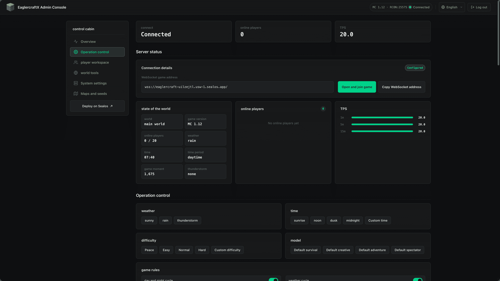

# EaglercraftX Server

Betreibe einen Minecraft-Server, dem Spieler direkt im Browser beitreten können, mit dauerhaftem Speicher und einem Admin-Panel für Spieler, Welten und Plugins. Das Docker-Image enthält die Clients EaglercraftX 1.8 / 1.12 und die Server Paper 1.8.8 / 1.12.2; die Spielversion wird beim Start gewählt.



<!-- README-I18N:START -->

[English](../../README.md) | [简体中文](./README.zh-CN.md) | [繁體中文](./README.zh-TW.md) | [日本語](./README.ja.md) | [한국어](./README.ko.md) | [Español](./README.es.md) | [Français](./README.fr.md) | **Deutsch** | [Português (Brasil)](./README.pt-BR.md) | [Русский](./README.ru.md) | [العربية](./README.ar.md) | [हिन्दी](./README.hi.md) | [Bahasa Indonesia](./README.id.md) | [Türkçe](./README.tr.md)

<!-- README-I18N:END -->

[Schnellstart](#schnellstart) · [Server beitreten](#dem-server-beitreten) · [Admin-Panel und Plugins](#admin-panel-und-plugins) · [Backups und Updates](#backups-updates-und-rollbacks) · [Fehlerbehebung](#betrieb-und-fehlerbehebung) · [Umgebungsvariablen](#umgebungsvariablen) · [Admin-API](#admin-api) · [Entwicklung und Releases](#entwicklung-builds-und-releases) · [Probleme melden](#probleme-melden)

## Funktionen

| Funktion | Details |
|------|------|
| Serververwaltung | Bereitschaft von Paper, Online-Spieler, Ticks pro Sekunde (TPS), Wetter, Zeit, Spielregeln, Konfiguration und kontrollierte Neustarts |
| Spieler und Welten | Operatorrechte (OP), Whitelists, Kicks, Sperren, Teleportation, Gegenstandsbefehle, Weltspeicherung und Weltgrenzen |
| Plugin-Verwaltung | Getrennte Ablagen je Spielversion; Upload, Aktivierung, Deaktivierung und Löschung mit Übernahme nach einem Paper-Neustart |
| Karten und Seeds | Eingebettetes Dynmap, Spielerpositionen, native Struktursuche und Links zu einer externen Seed Map |
| Enthaltene Plugins | LoginSecurity, SimpleHomes, SimpleTpa, WorldEdit, Dynmap |

## Schnellstart

### 1. Host vorbereiten

- **Host**: Installiere Docker und richte dauerhaften Speicher ein. Die Beispiele verwenden Linux-Pfade. Veröffentlichte Images sind für AMD64 vorgesehen; ARM64-Emulation und die Kompatibilität nativer Bibliotheken müssen separat geprüft werden. Siehe die [Architekturentscheidung](../adr/0006-publish-linux-amd64-only.md).
- **Arbeitsspeicher**: Paper und Bungee verwenden jeweils `-Xms256M -Xmx256M`. Plane zusätzlichen Speicher für die JVM außerhalb des Heaps, die Weltgenerierung und Plugins ein. Passe die Heap-Größe in `run.sh` im jeweiligen Laufzeitverzeichnis an.
- **EULA**: Das Startskript schreibt `eula=true`. Lies und akzeptiere die [Minecraft-EULA](https://www.minecraft.net/en-us/eula) vor dem Deployment.

### 2. Paper 1.12.2 starten

Führe diese Befehle auf dem Server aus. Ersetze `YOUR_SERVER` durch eine für Spieler erreichbare IP-Adresse oder Domain und `replace-with-a-strong-password` durch dein Admin-Passwort.

Dieses Beispiel bindet `/data/eagler-1.12` auf dem Host unter `/eaglerX-1.8-server` im Container ein und speichert das **gesamte Laufzeitverzeichnis** dauerhaft: Welten, Plugins, Konfiguration und Frontend-Dateien. Ein leeres Verzeichnis wird bei der ersten Verwendung automatisch initialisiert. Ist ein vorhandenes Verzeichnis unvollständig, bleiben seine Inhalte erhalten und der Start wird beendet. Für bestehende Installationen findest du die Migration unter [Backups, Updates und Rollbacks](#backups-updates-und-rollbacks).

```bash
docker pull --platform linux/amd64 ghcr.io/yangchuansheng/eaglerx1.8server:2.2.5

docker run -d \
  --name eaglerx-1.12 \
  --platform linux/amd64 \
  --stop-timeout 45 \
  -p 5200:5200 \
  -p 127.0.0.1:5201:5201 \
  -v /data/eagler-1.12:/eaglerX-1.8-server \
  -e MINECRAFT_VERSION=1.12 \
  -e 'RCON_PASSWORD=replace-with-a-strong-password' \
  -e 'PUBLIC_GAME_URL=http://YOUR_SERVER:5200' \
  ghcr.io/yangchuansheng/eaglerx1.8server:2.2.5
```

### 3. Admin-Panel öffnen und Bereitschaft prüfen

| Zugang | Adresse | Verwendung |
|------|------|----------|
| Spiel | `http://YOUR_SERVER:5200/` | Mit Spielern teilen und die [Beitrittsanleitung](#dem-server-beitreten) befolgen |
| Admin-Panel | `http://127.0.0.1:5201/admin` | Auf dem Host öffnen und mit dem beim Start gesetzten Admin-Passwort anmelden |

Die erste Weltgenerierung kann einige Minuten dauern. Der Start ist abgeschlossen, wenn das Admin-Panel **Paper is ready** anzeigt. Bei längerer Wartezeit oder Fehlern siehe [Betrieb und Fehlerbehebung](#betrieb-und-fehlerbehebung).

### Fernverwaltung und Ports

Öffne zur Verwaltung eines entfernten Servers einen SSH-Tunnel auf deinem eigenen Rechner. Ersetze `user@YOUR_SERVER` durch die SSH-Anmeldeadresse des Servers:

```bash
ssh -N -L 5201:127.0.0.1:5201 user@YOUR_SERVER
```

Halte den Tunnel offen und rufe `http://127.0.0.1:5201/admin` auf. Alternativ kannst du einen HTTPS-Reverse-Proxy mit `127.0.0.1:5201` auf dem Host als Upstream verwenden. Ein VPN-Verwaltungszugang muss den Datenverkehr an diese Loopback-Adresse weiterleiten können.

| Port | Zweck | Erreichbarkeit |
|------|------|----------|
| 5200 | HTTP-Spielseite, öffentliche statische Dateien und WebSocket-Spielverbindungen | Für Spieler freigeben |
| 5201 | Admin-Panel, HTTP-Fallback und Dynmap-Proxy | Auf dem Host an `127.0.0.1` binden |
| 25565 | Paper | Localhost innerhalb des Containers |
| 25575 | RCON | Localhost innerhalb des Containers |

### Eigene Domains, HTTPS und Spiel-URL

Setze `PUBLIC_GAME_URL` auf **die HTTP(S)-Spiel-URL, die Spieler tatsächlich verwenden**. Das Admin-Panel erzeugt daraus Schnellbeitrittslinks und `ws`- / `wss`-Adressen. Bei leerem Wert leitet es eine HTTP-URL aus dem aktuellen Hostnamen des Panels und Port 5200 ab (`http://主机名:5200/`). Setze den Wert ausdrücklich bei SSH-Tunneln, einer separaten Admin-Domain oder einem eigenen Spielport.

Ein HTTPS-Spielzugang erfordert DNS, ein Zertifikat sowie HTTP- und WebSocket-Weiterleitung an **5200**. Richte den Admin-Proxy auf **5201**. `PUBLIC_GAME_URL` dient nur zur Erzeugung von Verbindungsadressen; Proxy und Zertifikat konfigurierst du in deiner Bereitstellung.

### 1.8 wählen oder beide Versionen betreiben

`2.2.5` ist die Release-Version des Images. `MINECRAFT_VERSION=1.8` wählt Paper 1.8.8 und `1.12` wählt Paper 1.12.2. Jeder Container betreibt jeweils eine Spielversion und verwendet ein eigenes Laufzeitverzeichnis.

Passe für 1.8 diese Parameter im Schnellstartbefehl an:

| Parameter | Nur 1.8 betreiben | 1.8 neben 1.12 betreiben |
|------|-------------|---------------------|
| Containername | `--name eaglerx-1.8` | Wie links |
| Spielversion | `-e MINECRAFT_VERSION=1.8` | Wie links |
| Vollständiges Laufzeitverzeichnis | `-v /data/eagler-1.8:/eaglerX-1.8-server` | Wie links |
| Spielport | `-p 5200:5200` | `-p 5300:5200` |
| Admin-Port | `-p 127.0.0.1:5201:5201` | `-p 127.0.0.1:5301:5201` |
| Öffentliche Spiel-URL | `http://YOUR_SERVER:5200` | `http://YOUR_SERVER:5300` |

Setze `PUBLIC_GAME_URL` auf die URL dieser Instanz. Verwende zur Fernverwaltung der zweiten Instanz `ssh -N -L 5301:127.0.0.1:5301 user@YOUR_SERVER` und öffne `http://127.0.0.1:5301/admin`.

## Dem Server beitreten

1. Öffne die Spiel-URL oder den Schnellbeitrittslink, den der Serverbetreiber über die Seite Overview des Admin-Panels teilt. Der 1.12-Client startet mit einer leeren Serverliste; füge im Mehrspielermodus `ws://YOUR_SERVER:5200/` hinzu oder verwende bei HTTPS die entsprechende `wss://`-Adresse.
2. Folge beim ersten Besuch dem LoginSecurity-Hinweis und gib `/register <password>` ein. Bei späteren Besuchen verwendest du `/login <password>`. Standardmäßig ist eine Registrierung erforderlich; Passwörter müssen mindestens 6 Zeichen lang sein und die Anmeldung muss innerhalb von 30 Sekunden erfolgen.
3. LoginSecurity verwaltet die Passwörter der Spielerkonten. Das Admin-Panel verwendet das `RCON_PASSWORD` des Serverbetreibers.

SimpleHomes bietet `/sethome <name>`, `/home <name>` und `/homes`. SimpleTpa bietet `/tpa <player>`, `/tpaccept` und `/tpdeny`. Berechtigungen und Verhalten richten sich nach der aktuellen Plugin-Konfiguration.

## Admin-Panel und Plugins

### Anmelden und Änderungen übernehmen

Das Setzen von `RCON_PASSWORD` aktiviert RCON und die Admin-API. Nach der Anmeldung speichert der Browser ein Admin-Token in der aktuellen Sitzung; standardmäßig läuft es nach 8 Stunden ab. Beim Abmelden wird das lokale Token gelöscht. Die Oberfläche startet auf Englisch, unterstützt vereinfachtes Chinesisch und merkt sich die Sprachwahl für die jeweilige Website.

Die Anmeldung ist bereits während des Paper-Starts möglich. Spielsteuerungen werden verfügbar, sobald Paper bereit ist.

| Aktion | Wirksamkeit |
|------|----------|
| Wetter, Zeit, Spielregeln, Spieler- und Whitelist-Befehle | Werden an die laufende Paper-Instanz gesendet; Konsolenantwort prüfen |
| Serverkonfiguration wie MOTD, Spielerlimit, Sichtweite und PVP | Wird in `server.properties` geschrieben und nach einem Paper-Neustart übernommen |
| Plugins hochladen, aktivieren, deaktivieren oder löschen | Wird in der Plugin-Ablage gespeichert und nach einem Paper-Neustart übernommen |
| Minecraft-Neustart im Admin-Panel | Startet Paper kontrolliert neu, während Bungee und das Panel weiterlaufen |
| Herunterfahren im Panel oder `stop` in der Konsole | Paper beendet sich und löst das Herunterfahren des gesamten Containers aus |

Dynmap ist über den Proxy `/dynmap/` des Admin-Panels erreichbar. Die native Struktursuche verwendet die im Image enthaltene cubiomes-Komponente. Strukturen und ungefähre Spawnpunkte werden aus dem Welt-Seed berechnet; Spielerpositionen stammen von Dynmap oder Spielerspeicherständen. Beim Öffnen der externen Seed Map wird der Welt-Seed in die Ziel-URL aufgenommen.

### Plugin-Ablagen und Daten

Die Ablage der aktiven Version liegt unter `server-data/plugins-1.8` oder `server-data/plugins-1.12`. Das Verzeichnis `enabled/` enthält aktivierte Plugin-Pakete und Plugin-Daten; `disabled/` enthält deaktivierte Pakete. Der Paper-Pfad `plugins` verweist auf `enabled/` in der aktiven Ablage.

Beim ersten Start werden die enthaltenen Plugin-Pakete und Daten importiert. Spätere Starts erhalten den bestehenden Zustand einschließlich manueller Änderungen, deaktivierter Pakete und Löschungen. Der Mount des vollständigen Laufzeitverzeichnisses speichert all diese Daten dauerhaft.

Das Admin-Panel zeigt die aktive Spielversion, Dateigrößen, Änderungszeiten, den Zustand beim nächsten Start und ausstehende Neustarts an:

- Uploads müssen JAR-Dateien mit `plugin.yml` im Archivstamm sein. Dateinamen müssen mit kleingeschriebenem `.jar` enden; die Obergrenze beträgt **64 MiB**. Bereits vorhandene Dateinamen führen zu einem Konflikt.
- Starte nach Upload, Aktivierung, Deaktivierung oder Löschung eines Plugins über das Admin-Panel neu, um die aktualisierte Auswahl zu laden. Geladener Code bleibt bis zum Stoppen von Paper aktiv.
- Das Löschen entfernt die JAR-Datei und erhält Konfiguration und Datenbanken. Ein kompatibles, neu installiertes Plugin mit demselben Datenverzeichnis kann diese Daten weiterverwenden.
- JAR-Dateien werden mit den Rechten des Paper-Prozesses ausgeführt. Verwende vertrauenswürdige Quellen, prüfe und scanne Pakete vor der Installation und erstelle ein Backup.

<details>
<summary>Vorhandene Welten und separates Datenverzeichnis (Altbestandskompatibilität)</summary>

`PERSISTENT_DATA_ROOT` definiert ein gemeinsames Stammverzeichnis für Plugin-Ablagen und ältere Welt-Mounts. `SERVER_DATA_DIR` ist der Kompatibilitätsalias. Standardmäßig wird das vollständige Laufzeitverzeichnis eingebunden.

**Ein leeres separates Datenverzeichnis initialisiert nur die Plugin-Ablage.** Welt-Symlinks setzen voraus, dass die entsprechenden Welten bereits im Datenstamm liegen. Neue Welten verbleiben im versionsabhängigen Verzeichnis `server-版本/` und werden durch den vollständigen Laufzeit-Mount gesichert.

Stoppe für die Migration vorhandener Welten den Server und erstelle ein Backup. Bereite danach `<level-name>`, `<level-name>_nether` und `<level-name>_the_end` vor; die Standardnamen lauten `world`, `world_nether` und `world_the_end`. Der Einstiegspunkt kann auf diese Standardnamen zurückgreifen und erhält vorhandene echte Weltverzeichnisse an den Serverpfaden. Nutze je Version einen eigenen Datenstamm und kontrolliere nach dem Start jedes Symlink-Ziel.

</details>

## Backups, Updates und Rollbacks

### Server stoppen und sichern

Diese Befehle verwenden den Container und Mount aus dem Schnellstart. Backups enthalten Welten, Spielerzustände, Plugin-Daten, Konfiguration, Authentifizierungsdatenbanken und das Admin-Passwort. Bewahre sie in einem Verzeichnis mit eingeschränktem Zugriff auf.

```bash
docker stop -t 45 eaglerx-1.12
sudo install -d -m 700 /data/backups
sudo tar -czf "/data/backups/eagler-1.12-$(date +%Y%m%d-%H%M%S).tar.gz" \
  -C /data eagler-1.12
```

Führe nach einem regulären Backup `docker start eaglerx-1.12` aus. Während eines Updates bleibt der alte Container gestoppt. Bei einem externen `PERSISTENT_DATA_ROOT` muss auch dieser Datenstamm gesichert werden; tar erhält standardmäßig die Symlinks selbst.

Nach einem Stoppsignal gibt der Einstiegspunkt Paper bis zu 30 Sekunden zum Beenden, danach Bungee bis zu 10 Sekunden. Das Docker-Stoppzeitlimit von 45 Sekunden lässt hierfür Zeit. Siehe das [Stoppverhalten von Docker](https://docs.docker.com/reference/cli/docker/container/stop/).

### Update in einem neuen Verzeichnis vorbereiten

**Das vollständige Laufzeitverzeichnis wird nur beim ersten Start aus dem Image initialisiert.** Nach einem Image-Wechsel liefert der bestehende Mount weiterhin Server-, Frontend- und Python-Backend-Dateien. Ein Update erfordert den ausdrücklichen Austausch der Laufzeitdateien und die Migration des dauerhaften Zustands.

**Schritt 1: Stoppen und sichern.** Behalte den alten Container, das Laufzeitverzeichnis und die Image-Version.

**Schritt 2: Neues Laufzeitverzeichnis vorbereiten.** Kopiere die vollständige Vorlage aus dem Ziel-Image. Dieses Beispiel verwendet `2.2.5`; wähle einen unbenutzten Namen für den Vorlagencontainer und das Verzeichnis:

```bash
docker pull --platform linux/amd64 ghcr.io/yangchuansheng/eaglerx1.8server:2.2.5
docker create --name eaglerx-upgrade-template --platform linux/amd64 \
  ghcr.io/yangchuansheng/eaglerx1.8server:2.2.5
sudo mkdir /data/eagler-1.12-next
sudo docker cp eaglerx-upgrade-template:/opt/eaglerX-1.8-server-image/. \
  /data/eagler-1.12-next/
docker rm eaglerx-upgrade-template
```

Lasse den Vorlagencontainer ungestartet. [docker cp](https://docs.docker.com/reference/cli/docker/container/cp/) unterstützt das Kopieren aus gestoppten Containern. Migriere nach dem Kopieren der Vorlage den dauerhaften Zustand aus dem alten Verzeichnis:

| Daten | Migration |
|------|----------|
| `server-1.12/<level-name>` sowie die Nether- und End-Verzeichnisse | Vollständige Welten kopieren und `level-name` mit den Verzeichnisnamen abstimmen |
| `server-data/` | Gesamte Plugin-Ablage, Markerdateien und ältere Weltverzeichnisse kopieren |
| Paper-Dateien `*.properties`, `*.yml` und `*.json` | Konfiguration mit der neuen Vorlage zusammenführen; Operatoren, Whitelists, Sperren und Spielercaches erhalten |
| Bungee-Konfiguration, Authentifizierungsdatenbanken und Skin-Caches | Konfiguration und Datenbanken einzeln migrieren; eigene Zustände im Stamm- und in Plugin-Verzeichnissen prüfen |
| Angepasste Frontend-Dateien, Plugins und Startoptionen | Anpassungen nach Bedarf zusammenführen; Server-JARs, Skripte und Admin-Dateien aus dem Ziel-Image verwenden |

Der Einstiegspunkt erstellt die Symlinks `server/`, `web/` und Papers `plugins` neu. Kopiere externe Datenverzeichnisse in ein neues Host-Verzeichnis und binde dieses im neuen Container unter dem ursprünglichen Containerpfad ein. Behalte den alten Datenstamm für den alten Container. Berücksichtige auch Daten anderer Versionen und eigener Welten in der Migrationsliste.

**Schritt 3: Neuen Container starten.** Verwende den [Schnellstartbefehl](#2-paper-1122-starten) mit Containername `eaglerx-1.12-next`, Host-Verzeichnis `/data/eagler-1.12-next` und der Zielversion des Images. Spielversion, Passwort, öffentliche URL und Portzuordnungen bleiben wie bisher.

**Schritt 4: Migration prüfen.** Bestätige, dass Paper bereit ist, Spieler beitreten können, alte Welten vollständig vorliegen, Plugins laden und Whitelists sowie Karten funktionieren. Lege danach eine Aufbewahrungsdauer für den alten Container, das Image und die Backups fest.

### Rollback und Wiederherstellung

Wenn der alte Container und sein Verzeichnis erhalten sind, stoppe den neuen und starte den alten:

```bash
docker stop -t 45 eaglerx-1.12-next
docker start eaglerx-1.12
```

Ein Rollback stellt den im alten Verzeichnis gespeicherten Zustand wieder her. Bewahre die während des neuen Containerbetriebs entstandenen Daten für eine spätere Wiederherstellung auf. Entpacke ein komprimiertes Backup in ein neues Verzeichnis, binde das entpackte `eagler-1.12` als vollständiges Laufzeitverzeichnis ein und verwende die zum Backup gehörige Image-Version und Startoptionen.

## Betrieb und Fehlerbehebung

Diese Befehle verwenden den Standardnamen des Containers:

```bash
# Container health and entrypoint / HTTP logs
docker inspect --format '{{.State.Status}} / {{.State.Health.Status}}' eaglerx-1.12
docker logs --tail 100 eaglerx-1.12

# Paper console output in the managed tmux session
docker exec -e TMUX_TMPDIR=/tmp/eaglerx-tmux eaglerx-1.12 \
  tmux capture-pane -p -t mcserver:0.1 -S -100

# Public status probe when RCON is enabled, via the host or SSH tunnel
curl -sS http://127.0.0.1:5201/api/status
```

Paper und Bungee laufen in tmux. Die gezeigte Paper-Konsole verwendet standardmäßig das Pane `mcserver:0.1`; Bungee verwendet `mcserver:0.0`. Der Docker-Healthcheck prüft die Ports 5200, 5201 und 25565. Das Admin-Panel prüft zusätzlich RCON, um die Bereitschaft von Paper zu ermitteln.

| Symptom | Prüfung |
|------|------------|
| Container beendet sich sofort | Prüfen, ob `MINECRAFT_VERSION` auf `1.8` oder `1.12` steht, und den konkreten Fehler im Log nachsehen |
| Start meldet unvollständiges Laufzeitverzeichnis | Leeres Verzeichnis initialisieren oder vollständiges Backup wiederherstellen; aktuelles Verzeichnis zur Untersuchung behalten |
| Panel ist geöffnet, Paper startet noch | Weltgenerierung und Plugin-Ladevorgang in der Paper-Konsole prüfen; das Panel aktualisiert sich bei Bereitschaft automatisch |
| Entferntes Admin-Panel unerreichbar | Prüfen, ob SSH-Tunnel oder Admin-Proxy `127.0.0.1:5201` auf dem Host erreichen |
| Falscher Schnellbeitrittslink oder HTTPS-Verbindungsfehler | `PUBLIC_GAME_URL`, öffentlichen Port und WebSocket-Weiterleitung des Spielproxys prüfen |
| `/api/status` liefert 404 | `RCON_PASSWORD` setzen und Container neu erstellen; das Startskript aktiviert damit RCON |
| Anmeldung liefert 429 | Fünf Fehlversuche einer Quelle im Fehlerzeitfenster lösen eine Sperre von 10 Minuten aus; Administratoren hinter Tunneln oder Proxys können dieselbe Quelle haben |
| Änderungen sind gespeichert, altes Verhalten bleibt bestehen | Kontrollierten Paper-Neustart im Panel ausführen und Laufzeitzustand prüfen |
| Dynmap liefert 502 | Aktivierung und vollständiges Laden von Dynmap prüfen, danach HTTP-Adresse und Port |
| Native Struktursuche schlägt fehl | Laufzeitumgebung `linux/amd64`, Ladefehler nativer Bibliotheken und Abruf des Welt-Seeds prüfen |

Der Einstiegspunkt startet Bungee, Paper und HTTP in dieser Reihenfolge und überwacht sie dauerhaft. Beendet sich ein Kerndienst, wird der gesamte Container mit Fehlerstatus heruntergefahren. Bei `SIGTERM` / `SIGINT` erfolgt ein geordnetes Herunterfahren. Berücksichtige bei der Neustartstrategie, dass ein Abschalten im Admin-Panel den Container ebenfalls beendet.

## Umgebungsvariablen

Übergib sie mit `docker run -e`. Erstelle den Container bei Änderungen seiner Umgebungsvariablen mit dem vorhandenen Mount neu.

| Variable | Standard | Beschreibung |
|------|--------|------|
| `MINECRAFT_VERSION` | Erforderlich | `1.8` wählt Paper 1.8.8; `1.12` wählt Paper 1.12.2 |
| `RCON_PASSWORD` | Leer | Aktiviert RCON und Admin-API bei gesetztem Wert; bei leerem Wert sind authentifizierte Admin-Endpunkte deaktiviert |
| `PUBLIC_GAME_URL` | Leer | Öffentliche HTTP(S)-Spiel-URL für Schnellbeitrittslinks und WebSocket-Adressen |
| `PERSISTENT_DATA_ROOT` | `${APP_DIR}/server-data` | Stamm für Plugin-Ablagen und ältere Mounts vorhandener Welten; ein leeres Verzeichnis initialisiert die Plugin-Ablage automatisch |
| `SERVER_DATA_DIR` | Leer | Kompatibilitätsalias für `PERSISTENT_DATA_ROOT`; ein ausdrücklich gesetzter Wert der letzteren Variable hat Vorrang |
| `ADMIN_AUTH_TOKEN_TTL` | `28800` | Gültigkeitsdauer des Admin-Tokens in Sekunden |
| `ADMIN_AUTH_SECRET` | Aus dem RCON-Passwort abgeleitet | Optionales Geheimnis zur Token-Signierung |
| `DYNMAP_HOST` / `DYNMAP_PORT` | `127.0.0.1` / `8123` | Vom Admin-Backend verwendete Dynmap-Upstream-Adresse |

## Admin-API

Für Skriptintegrationen. Alle Endpunkte verwenden Admin-Port **5201**. Alltägliche Aufgaben lassen sich im Admin-Panel erledigen.

<details>
<summary>Endpunkte, Authentifizierung und curl-Beispiele</summary>

„Öffentlich“ beschreibt die Authentifizierungsanforderungen des Endpunkts selbst. Greife über einen [SSH-Tunnel oder Admin-Proxy](#fernverwaltung-und-ports) auf den Admin-Port zu.

| Endpunkt | Zugriffsanforderungen |
|------|----------|
| `GET /api/connection-info` | Immer verfügbar; liefert die Konfiguration des öffentlichen Spielzugangs |
| `GET /api/status` | Bei aktiviertem RCON verfügbar; liefert Paper-Status und zugehörige Informationen |
| `POST /api/login` | Tauscht bei aktiviertem RCON das Admin-Passwort gegen ein Token |
| JSON-Admin-Endpunkte wie `POST /api/rcon`, `/api/config`, `/api/system` und `/api/plugins` | Anfragekörper muss ein gültiges `token` enthalten |
| `POST /api/plugins/upload` | `Authorization: Bearer <token>`, unverarbeitete JAR im Anfragekörper und Header `X-Plugin-Filename` |
| `GET /dynmap/` | Direkter Proxy zu Dynmap; die Verwaltungsverbindung schützt den Zugriff |

JSON-Anfragen haben ein Größenlimit von 64 KiB und ein Lesezeitlimit von 10 Sekunden. JAR-Uploads sind auf 64 MiB und insgesamt 30 Sekunden Lesezeit begrenzt. Administratoren mit gemeinsamer Tunnel- oder Reverse-Proxy-Quelle können dasselbe Anmeldesperrfenster teilen.

```bash
# Exchange the management password for a token
curl -sS http://127.0.0.1:5201/api/login \
  -H 'Content-Type: application/json' \
  -d '{"password":"replace-with-a-strong-password"}'

# Use the returned token for a management command
curl -sS http://127.0.0.1:5201/api/rcon \
  -H 'Content-Type: application/json' \
  -d '{"command":"list","token":"TOKEN_FROM_LOGIN"}'
```

</details>

## Entwicklung, Builds und Releases

### Lokale Änderungen und Validierung

Führe diese Befehle mit installiertem Python 3 und Docker im Repository-Stamm aus. Bearbeite Admin-Dateien in `web-1.8/` und aktualisiere `web-1.12/` mit dem Synchronisierungsskript. Anforderungen an Basis-Image und native Bibliotheken stehen in der [Entscheidung zum Laufzeit-Basis-Image](../adr/0007-retain-the-verified-runtime-base.md).

```bash
python3 script/sync_admin_assets.py
python3 script/sync_admin_assets.py --check
docker build --platform linux/amd64 -t eaglerx-local:dev .
```

Die lokale Release-Prüfung erfordert außerdem Node.js, tmux, `agent-browser` und ein funktionsfähiges Chrome. Die CI verwendet fest `agent-browser@0.26.0`; Installationsschritte stehen im [Release-Workflow](../../.github/workflows/release.yml).

```bash
agent-browser doctor
./script/release_gate.sh --evidence-dir artifacts/release-gate
```

Lokale Prüfungen decken Python-Syntax, Server- und Plugin-Regressionen, Ressourcen beider Versionen, Admin-Dateien und Browserabläufe in Englisch und vereinfachtem Chinesisch ab. Browserprüfungen verwenden eine lokale Mock Admin API. Die vollständige Release-Validierung baut zusätzlich das Image und startet beide Paper-Versionen:

```bash
./script/release_gate.sh \
  --build --live \
  --image eaglerx-release-gate:local \
  --evidence-dir artifacts/release-gate
```

Die Prüfung setzt `release_ready` in `summary.json` erst nach erfolgreichen vollständigen `--live`-Prüfungen auf `true`. Abdeckung, Nachweisformate und Rechte für temporäre Linux-Mounts beschreibt die [Release-Gate-Dokumentation](../release-gate.md).

### Release veröffentlichen

Offizielle Releases verwenden Git-Tags `vMAJOR.MINOR` oder `vMAJOR.MINOR.PATCH`. Der Workflow prüft dasselbe Image vollständig und veröffentlicht es danach in GHCR mit Versions- und Commit-SHA-Tags sowie einem Herkunftsnachweis des Builds. Automatische Releases der höchsten Version aktualisieren `latest`. Manuelle Wiederholungen aktualisieren nur die angegebene Version und die SHA-Tags.

```bash
gh workflow run release.yml -f release_tag=v2.2.5
```

`build.sh` bündelt lokale Builds; das Argument `push` überträgt das Image direkt. Die offizielle Verteilung folgt der [Vorgabe für vollständige Live-Prüfungen](../adr/0005-require-the-live-release-gate.md) und dem beschriebenen Tag-Workflow.

## Probleme melden

Melde Deployment-Probleme und Funktionswünsche über [GitHub Issues](https://github.com/yangchuansheng/eaglerXserver/issues). Gib Image-Tag, `MINECRAFT_VERSION`, Host-Architektur, bereinigte Startoptionen, Reproduktionsschritte und relevante Fehlermeldungen an. Entferne Passwörter und Tokens vor dem Absenden.

## Danksagung

- Eaglercraft / EaglercraftX: lax1dude (Calder Young)
- Eaglercraft server: ayunami2000
- [Ursprungsprojekt](https://github.com/burgerhugger/ALL-server)
